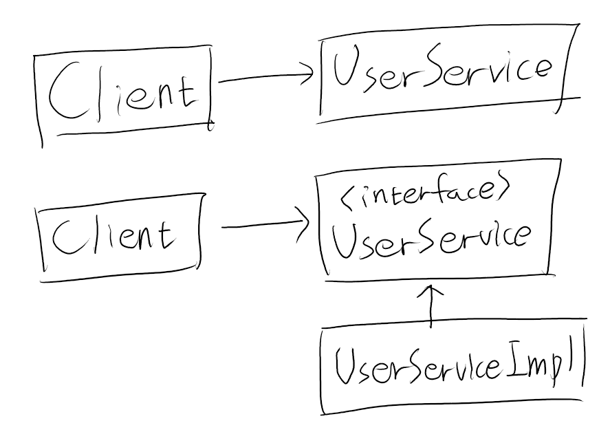
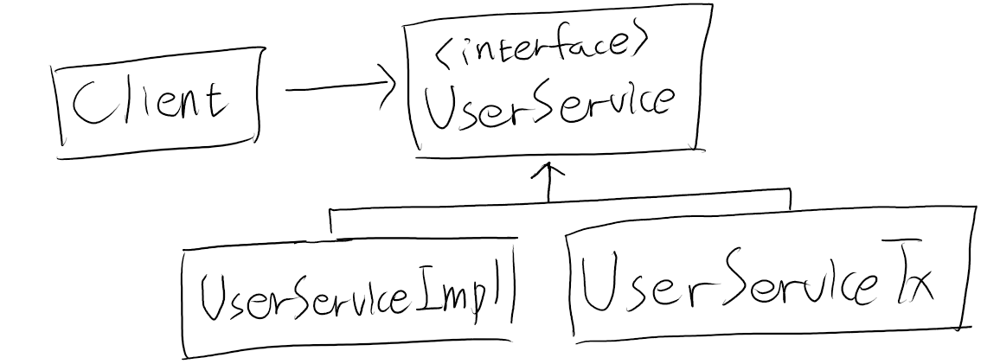
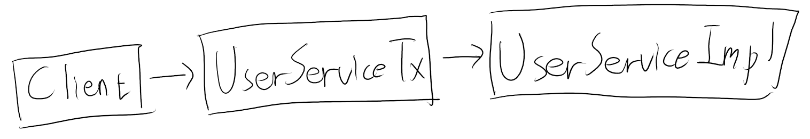
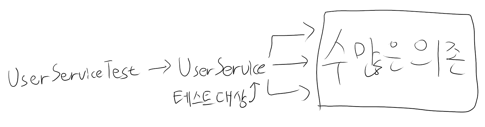
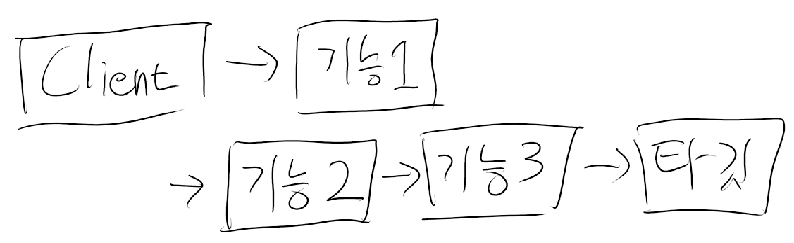
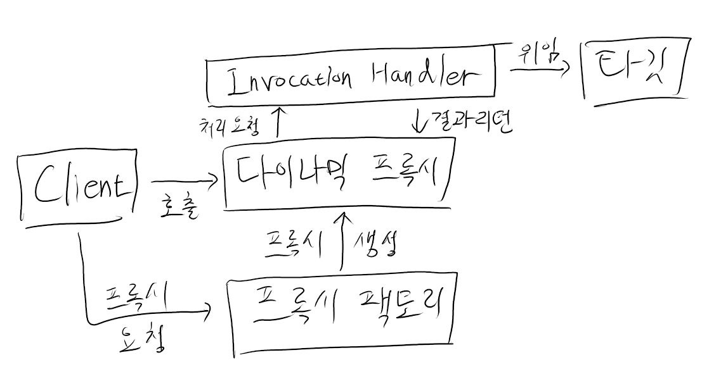
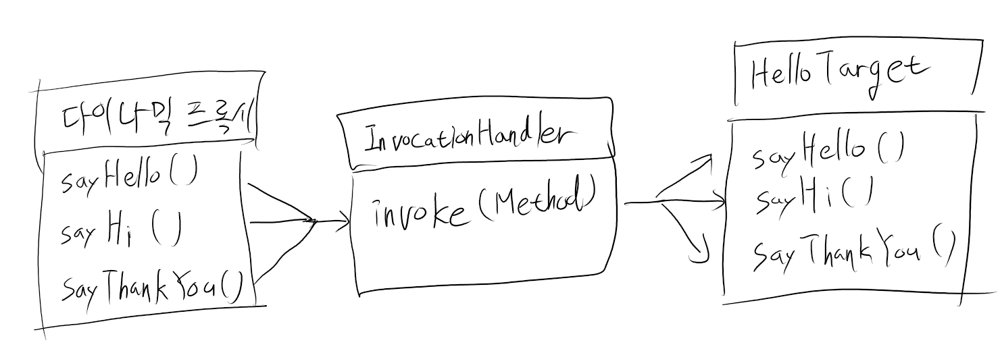
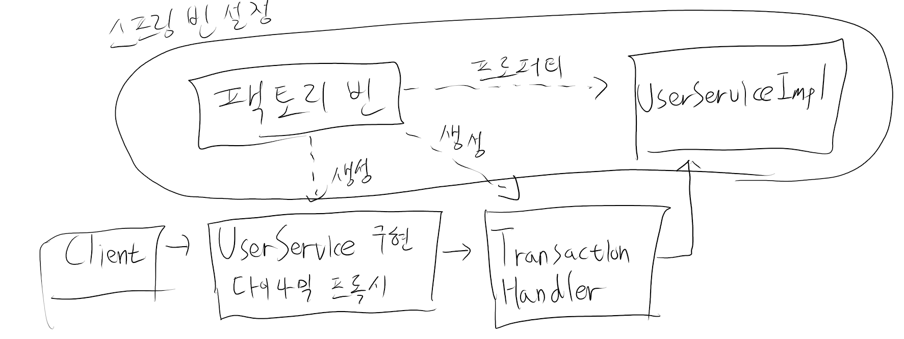
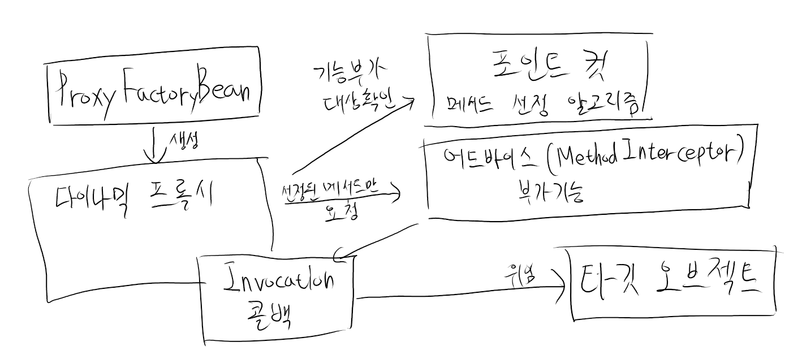
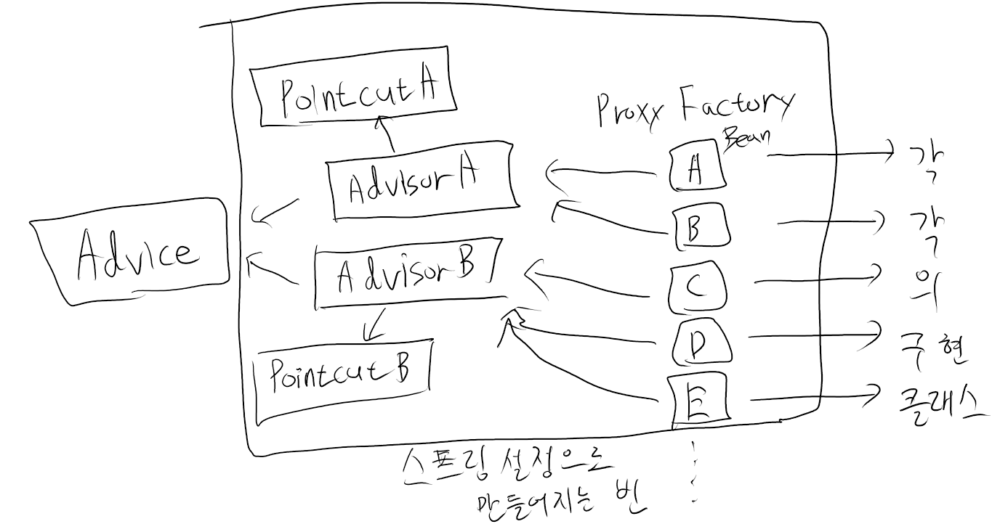

# AOP

### 메서드 분리

```java
public void upgradeLevels() throws Exception {
    트랜잭션 시작
    try {
        upgradeLevelsInternal(); // 추출한 메서드 
    }
    트랜잭션 끝    
}

private void upgradeLevelsInternal() {
    비즈니스 로직
}
```

비즈니스 로직을 담당하는 코드를 메서드로 추출해서 독립시킨다. 

비즈니스 로직 코드만 독립적인 코드에 담겨 있어 이해하기도 편하고 수정하기에 부담도 없어진다.

### DI를 이용한 분리

클라이언트가 사용중인 클래스를 인터페이스로 추상화하고 
인터페이스 아래에 두 개의 구현 클래스를 만들어서 이용한다.

```java
public interface UserService {
    void add(User user);
    void upgradeLevels();
}
```

구현 클래스에서 핵심 로직이 들어간 클래스를 Impl 클래스로 설정하고,    
핵심 로직 위 아래에 경계설정 로직이 들어간 클래스 Tx 를 따로 만든다.

```java
public class UserServiceImpl implements UserService {
    UserDao userDao;
    MailSender mailSender;
    
    public void upgradeLevels() {
        비즈니스 로직
    }
}
```



Tx 클래스에서는 경계설정 API를 위한 오브젝트와 핵심 로직이 들어간 Impl 을 주입 받고   
핵심 로직은 주입 받은 Impl 의 오브젝트에 모든 기능을 위임한다.

```java
public class UserServiceTx implements UserService {
    UserService userService;
    
    public void setUserService(UserService userService) {
        this.userService = userService;
    }
    
    public void add(User user) {
        userService.add(user);
    } 
    
    public void upgradeLevels() {
        userService.upgradeLevels();
    }
}
```

```java
public class UserServiceTx implements UserService {
    UserService userService;
    PlatformTransactionManager transactionManager;
    
    public void setTransactionManager(PlatformTransactionManager transactionManager) {
        this.transactionManager = transactionManager;
    }
    
    public void setUserService(UserService userService) {
        this.userService = userService;
    }
    
    public void add(User user) {
        userService.add(user);
    } 
    
    public void upgradeLevels() {
        
        트랜잭션 시작
                
        try {
            userService.upgradeLevels();
            성공시 커밋
        } catch (RuntimeException e) {
            실패시 롤백
            throw e;
        }
    }
}
```



이후 경계설정이 필요한 메서드에는 메서드 호출 전과 후에 경계설정 API를 사용해준다. 

### 의존관계




### 개선점
핵심 로직이 들어간 Impl 의 코드를 작성할 때는 트랜잭션과 같은 기술적인 내용에 신경쓰지 않아도 된다.   
DI를 이용하여 경계설정 기능이 들어간 오브젝트가 먼저 실행되도록 만들기만 하면 된다.

복잡한 의존관계를 가졌을 때 보다 테스트가 쉬워진다.


### 단위 테스트



테스트는 가능한 한 작은 단위로 해야 한다. 

리턴 값이 없는 메서드는 결과를 받아서 검증하는 것이 불가능하다.    
DB에 적용하는 메서드의 테스트인 경우 mock 오브젝트를 만들어서 결과를 저장하고   
메서드의 실행 조건에 조건에 해당하는 대상의 메서드 실행 여부를 확인한다.    
이후 mock 오브젝트에서 결과를 받아온 후 원하는 결과값과 비교한다.

이러한 단위 테스트는 API 연결 없이 실행되기 때문에 속도가 빠르다.

- 항상 단위 테스트를 고려해야 한다.
- 외부 리소스를 사용해야만 가능한 테스트는 통합 테스트로 만든다.

코드 작성 후에는 테스트를 만들어야 한다.

### Mockito
mock 오브젝트를 편리하게 만들게 해준다.

Mock 오브젝트 사용 단계

1. 인터페이스로 mock 오브젝트를 만든다.
2. 리턴할 값이 있다면 이를 지정한다. 예외를 던지게 만들 수도 있다.
3. 테스트 대상 오브젝트에 DI 해서 mock 오브젝트가 테스트 중에 사용되도록 한다.
4. 테스트 대상 오브젝트 사용 후 특정 메서드의 호출 결과를 검증한다.

```java
public void mockUpgradeLevels() {
    UserServiceImpl userServiceImpl = new UserServiceImpl();
    
    UserDao mockUserDao = mock(UserDao.class);
    when(mockUserDao.getAll()).thenReturn(this.users); // 리턴값 지정
    userServiceImpl.setUserDao(mockUserDao);
 
    MailSender mockMailSender = mock(MailSender.class);
    userServiceImpl.setMailSender(mockMailSender); // 테스트 대상 오브젝트에 DI
    
    userServiceImpl.upgradeLevels(); // 메서드 호출
    
    verify(mockUserDao, times(2)).update(any(User.class)); // 메서드의 호출 결과 검증
    verify(mockUserDao, times(2)).update(any(User.class));
    verify(mockUserDao).update(users.get(1));
    assertThat(users.get(1).getLevel()).isEqualTo(Level.Silver);
}
```

### 데코레이터 패턴
> 타깃에 부가적인 기능을 런타임 시 동적으로 부여해주기 위해 프록시를 사용하는 패턴



컴파일 시점에는 정해져 있지 않다. 구성에 따라 여러 개의 데코레이터를 적용할 수도 있다.

스프링 DI를 이용하여 같은 인터페이스를 구현한 다른 데코레이터 또는 타깃 빈을 설정한다.

데코레이터 패턴은 인터페이스를 통해 위임하는 방식이기 때문에 어느 데코레이터에서 
타깃으로 연결될지 코드 레벨에선 미리 알 수 없다. 

### 프록시 패턴
> 프록시를 사용하는 방법 중에서 타깃에 대한 접근 방법을 제어한다.
 - 프록시 : 클라이언트와 사용 대상 사이에 대리 역할을 맡은 오브젝트를 두는 방법

클라이언트에게 타깃에 대한 레퍼런스를 넘겨야 하는데, 타깃 오브젝트 대신 프록시를 넘긴다.   
프록시 메서드를 통해 타깃을 사용하려고 시도하면 프록시가 타깃 오브젝트를 생성하고 요청을 위임한다.   

오브젝트의 생성 시점을 최대한 늦춰서 __자원관리에 이점이__ 있다.

대상 오브젝트가 외부 API인 경우에도 프록시를 사용하여 로컬 오브젝트처럼 사용하다가   
결과를 받아오는 메서드가 실행될 때 외부 접속을 하여 결과를 반환한다.

프록시로 접근을 제어하고, 이후 데코레이터를 추가하여 설정을 추가하고   
마지막으로 핵심 기능이 들어간 구현 클래스를 호출한다.

```java
public class UserServiceTx implements UserService {
    UserService userService;
    
    public void add(User user) {
        this.userService.add(user); // 메서드 구현과 위임
    }
    
    public void upgradeLevels() {
        // 부가기능 수행과 위임
        트랜잭션 시작
        try {
            userService.upgradeLevels(); // 위임
            
            성공시 커밋
        } catch (RuntimeException e) {
            실패시 롤백
            throw e;
        }
    } 
}
```

### 프록시 문제점
1. 부가기능이 필요 없는 메서드도 구현해서 타깃으로 위임하는 코드를 전부 만들어야 한다.
2. 부가기능 코드가 중복될 가능성이 많다. 기능이 많아지면 유사한 코드가 여러 메서드에 중복된다.

### 리플렉션

리플렉션은 자바의 코드 자체를 추상화해서 접근하도록 만든 것이다.

리플렉션 API 중에서 Method 인터페이스를 이용하면 메서드를 호출할 수 있다.

```java
Method lengthMethod = String.class.getMethod("length");
int length = lengthMethod.invoke(name);
```

### 다이나믹 프록시



> 프록시 팩토리에 의해 런타임 시 다이나믹하게 만들어지는 오브젝트   
> 
> 클라이언트는 타겟 인터페이스를 통해 다이나믹 프록시 오브젝트를 사용할 수 있다.

InvocationHandler 를 구현한 오브젝트에 부가기능을 담는다.   

다이나믹 프록시 오브젝트는 클라이언트의 모든 요청을 리플렉션 정보로 변환해서    
InvocationHandler 구현 오브젝트의 invoke() 메서드로 넘긴다.

클라이언트는 클래스에 필요한 핸들러를 생성하고 난 후 이를 DI하고 프록시 클래스의 인스턴스를 생성하여 사용한다.



```java
public class UppercaseHandler implements InvocationHandler {

    Hello target;

    public UppercaseHandler(Hello target) {
        this.target = target;
    }

    @Override
    public Object invoke(Object proxy, Method method, Object[] args) throws Throwable {
        Object ret = method.invoke(target, args);
        if(ret instanceof String && method.getName().startsWith("say")) {
            return ((String)ret).toUpperCase();
        } else {
            return ret;
        }

    }
}
```

이를 트랜잭션 코드에도 적용시키자

```java
import java.lang.reflect.InvocationHandler;
import java.lang.reflect.InvocationTargetException;

public class TransactionHandler implements InvocationHandler {
    private Object target; 
    private PlatformTransactionManager transactionManager; // Setter DI
    private String pattern; // Setter DI

    public Object invoke(Object proxy, Method method, Object[] args) throws Throwable {
        if (method.getName().startsWith(pattern)) {
            return invokeInTransaction(method, args);
        } else {
            return method.invoke(target, args);
        }
    }

    private Object InvokeInTransaction(Method method, Object[] args) throws Throwable {
        TransactionStatus status =
                this.transactionManager.getTransaction(new DefaultTransactionDefinition());
        try {
            Object ret = method.invoke(target, args);
            this.transactionManager.commit(status);
            return ret;
        } catch (InvocationTargetException e) {
            this.transactionManager.rollback(status);
            throw e.getTargetException();
        }
    }
}
```

타깃과 트랜잭션 추상화 인터페이스 PlatformTransactionManager 를 DI 받는다. 

그리고 타깃의 메서드에서 트랜잭션을 적용할 메서드 이름의 패턴을 DI 받는다.

### 팩토리 빈
위의 다이내믹 프록시를 스프링 DI를 통해 사용하려면 팩토리 빈을 만들어야 한다.   
팩토리 빈은 오브젝트의 생성 로직을 담당하도록 만들어진 빈이다.

팩토리 빈은 설정된 정보를 이용하여 다이나믹 프록시를 반환한다. 

```java
public class Message {
    String text;
    
    private Message(String text) {
        this.text = text;
    }
    
    public String getText() {
        return text;
    }
    
    public static Message newMessage(String text) {
        return new Message(text);
    }
}
```

```java
public class MessageFactoryBean implements FactoryBean<Message> {
    String text;
    
    public void setText(String text) {
        this.text = text;
    }
    
    public Message getObject() throws Exception {
        return Message.newMessage(this.text);
    }
    
    public Class<? extends  Message> getObjectType() {
        return Message.class;
    }
    
    public boolean isSingleton() {
        return false;
    }
}
```
```xml
빈 등록
<property name="text" value="Factory Bean">
```



#### 장점
1. 다른 클래스가 해당 팩토리 빈을 사용하여 팩토리 빈의 기능을 그대로 사용할 수 있다.   
코드의 변경 없이 다양한 클래스에서 사용할 수 있다.

2. 다이나믹 프록시를 이용하면 하나의 핸들러 메서드만으로도 수많은 메서드에 부가기능을 부여할 수 있다.   
여기에 팩토리 빈을 이용한 DI까지 더해지면 다이나믹 프록시 생성 코드도 제거할 수 있다.

#### 한계
1. 클래스가 추가될수록 팩토리 빈 설정이 부가기능의 개수만큼 추가된다. 

2. 핸들러 오브젝트가 프록시 팩토리 빈 개수만큼 만들어진다.

### 스프링의 프록시 팩토리 빈
프록시를 생성해서 빈 오브젝트로 등록하게 해주는 팩토리 빈이다.   
순수하게 프록시를 생성하는 작업만을 담당하고 프록시를 통해 제공해줄 부가기능은 별도의 빈에 둘 수 있다.

프록시 팩토리 빈의 MethodInterceptor 는 InvocationHandler 와 달리 프록시 팩토리 빈으로부터
타깃 오브젝트에 대한 정보까지 함께 제공받아 타깃 오브젝트에 상관없이 독립적으로 만들어질 수 있다.

- 어드바이스 : 타깃 오브젝트에 적용하는 부가기능을 담은 오브젝트    
  타겟 오브젝트에 종속되지 않는 순수한 부가기능만 담는다.

프록시 팩토리 빈을 만들고 여기에 타깃을 추가한다. setTarget()    
그리고 부가기능을 담은 어드바이스를 추가한다. addAdvice()

이렇게 하면 많은 부가기능을 사용하더라도 ProxyFactoryBean 하나로 충분하다.

### 포인트컷
> 부가기능 적용 대상 메서드 선정 방법(알고리즘)

기존 InvocationHandler 는 특정 타겟을 위한 프록시에 제한된다.    
반면 ProxyFactoryBean 은 Advice, Poincut 을 활용하여 유연한 구조를 제공한다.



1. 클라이언트의 요청을 받으면 포인트컷으로 부가기능을 부여할 메서드인지 체크한다.
2. 확인받으면 MethodInterceptor 타입의 어드바이스를 호출한다.
3. 어드바이스는 템플릿 구조로 설계되어 있고 메서드 호출이 필요하다면    
   MethodInvocation 타입의 콜백 오브젝트의 proceed() 메서드를 호출한다.
   
템플릿은 한 번 만들면 재사용이 가능하고 여러 빈이 공유해서 사용할 수 있는 것처럼   
어드바이스도 싱글톤 빈으로 등록하고 DI를 주입해서 여러 프록시가 사용하도록 할 수 있다.

- 어드바이저 : 어드바이스와 포인트컷을 묶은 오브젝트

